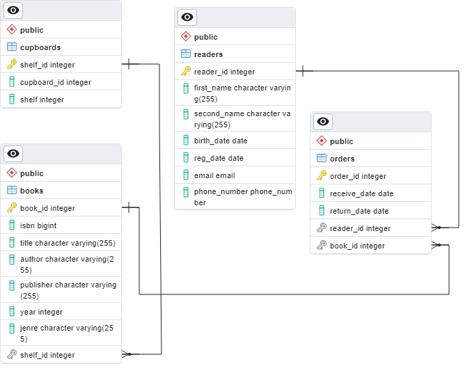

## About library script

Create_table.py is a simple script for create basic number of tables for library. Python version used 3.10.6, PostgreSQL version 15.

For use this script on your own machine you must make database.ini file with your own settings. 

```
[postgresql]
host=localhost
database=db_name
user=user
password=password
port=5433
```

### Database entity relationship model


### Join query for database

Query returns reader name, phone number, book ID and title, cupboard and shelf for this book where return date between '2022-12-01' AND '2022-12-31'

```
SELECT r.first_name readerName,
r.phone_number phone,
o.book_id bookID,
o.return_date returnDate,
b.title title,
cup.cupboard_id,
cup.shelf shelf
FROM readers r
JOIN orders o ON r.reader_id = o.reader_id
JOIN books b ON o.book_id = b.book_id
JOIN cupboards cup ON cup.shelf_id = b.shelf_id
WHERE o.receive_date BETWEEN '2022-12-01' AND '2022-12-31';
```